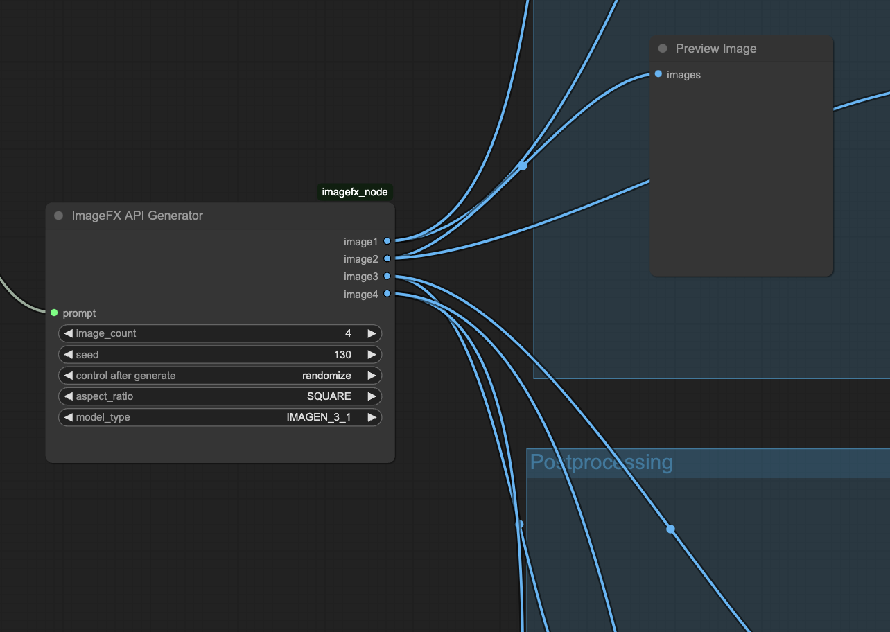

# ImageFX API Generator for ComfyUI

## Overview

This custom node is based on [ImageFX API](https://github.com/rohitaryal/imageFX-api) and integraded into [ComfyUI](https://github.com/comfyanonymous/ComfyUI), allowing you to generate four high-quality images from a prompt using Google's ImageFX platform.

The node sends a prompt to the API and returns up to 4 results, automatically converting them into ComfyUI-compatible image tensors.

## API

This node requires an access token from the ImageFX API. To obtain it, follow the instructions from the [original project](https://github.com/rohitaryal/imageFX-api):

1. Go to the official [ImageFX page](https://labs.google) in your browser.
2. Open your developer tools.
3. Paste the following JavaScript in the console:

```javascript
let script = document.querySelector("#__NEXT_DATA__");
let obj = JSON.parse(script.textContent);
let authToken = obj["props"]["pageProps"]["session"]["access_token"];
window.prompt("Copy the auth token: ", authToken);
```

4. Copy the prompted token.

## Authentication Setup

Once you have the token, you can use either of the following methods:

### Option A: Use Environment Variable

Set an environment variable in your system:

```bash
export IMAGEFX_AUTH_TOKEN="your-token-here"
```

### Option B: Use `.auth` File

Create a file named `ifx_config.auth` in the same folder as the node script and paste the token into the file:

```
Bearer your-token-here
```

## Installation

1. Copy the node script (e.g. `imagefx_node.py`) into a subfolder under `ComfyUI/custom_nodes/`.
2. Make sure the token is configured via environment variable or `.auth` file.
3. Restart ComfyUI.
4. Look for `ImageFX API Generator` in the node browser.

## Features

- Text-to-image generation with Google's ImageFX API
- Returns 4 images per request (or fills in with blank images)
- Supports custom prompt, seed, aspect ratio, and model type
- Automatically handles RGBA conversion and tensor formatting
- Logs all steps and errors in the console if debug is enabled

## Workflow Example



## License

MIT License.
